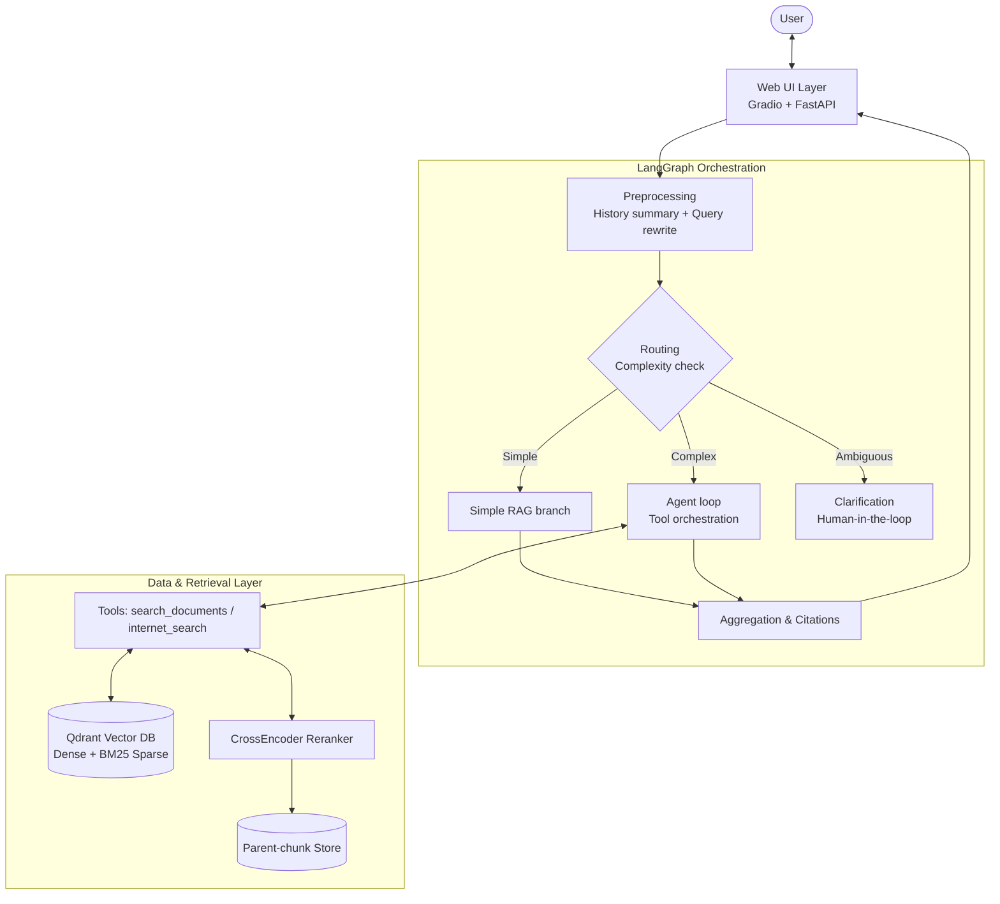

# Document RAG Chatbot

A practical, domain-agnostic **Retrieval-Augmented Generation (RAG)** assistant built with **LangGraph**, **Qdrant**, and **Gradio**. It enables natural-language Q&A over internal document collections (PDF, DOCX, TXT, MD) with source citations, hybrid retrieval, CrossEncoder reranking, and optional DuckDuckGo web search fallback.

By default, the project includes a working profile for the **EU AI Act** (`profiles/eu_ai_act/`) and can run **100% offline** using Ollama and local Qdrant.


---

## Key Features

- **Hybrid Search**: Combines dense semantic embeddings (`Qwen/Qwen3-Embedding-0.6B`) with sparse BM25 vectors in Qdrant to capture both semantic meaning and exact keyword/article identifiers.
- **CrossEncoder Reranking**: Re-orders candidate chunks using `BAAI/bge-reranker-base` to feed only high-relevance context to the LLM.
- **Parent/Child Chunking**: Small child chunks ensure precise vector representations, while full parent chunks are retrieved to provide coherent context.
- **LangGraph Workflow**:
  - **Query Rewriting & Conversation Summarization**: Resolves follow-up queries and pronouns using conversation history before retrieval.
  - **Complexity-Based Routing**: Greetings receive immediate responses; direct queries take a fast RAG path; complex or comparative questions trigger sub-query decomposition or an agent tool-calling loop.
  - **Clarification Handling**: Automatically pauses and asks for user clarification when queries are ambiguous.
  - **Internet Search Tool**: DuckDuckGo integration for real-time or current event queries outside the ingested corpus.
- **Clean Interactive Web UI**:
  - Modern chat interface built with Gradio & FastAPI (`http://127.0.0.1:7860`).
  - Collapsible streamed reasoning trace and clear source document citations.
  - Persistent chat history backed by SQLite (`db/chat_history.db`).
  - Source mode selector menu: All sources, RAG only, or Internet only.
- **Domain Profiles**: Prompts, terminology, response language, and separators are decoupled into pure data configurations under `profiles/`, making it easy to swap in new document collections (company policies, technical manuals, regulatory texts, etc.).

---

## System Architecture



> **Note**: A live interactive architecture diagram is also served directly by the application at `http://127.0.0.1:7860/architecture`.

---

## Tech Stack

| Component | Technology | Description |
|---|---|---|
| **Orchestration** | LangGraph & LangChain | State graph execution, query routing, tool calling |
| **LLM Provider** | Ollama (default) / OpenAI / Anthropic / Google / Z.ai | Local-first with Ollama (`qwen3:4b-instruct-2507-q4_K_M`), configurable via `.env` |
| **Vector DB** | Qdrant (local embedded) | Hybrid dense + sparse (BM25) search |
| **Dense Embedding** | `Qwen/Qwen3-Embedding-0.6B` | Multilingual dense embedding model |
| **Reranker** | `BAAI/bge-reranker-base` | CrossEncoder for relevance re-ranking |
| **Document Processing** | PyMuPDF4LLM, python-docx | Parses PDF, DOCX, TXT, MD files into structured Markdown |
| **Web Interface** | Gradio 5 + FastAPI | Responsive UI with collapsible reasoning & history sidebar |
| **Chat Persistence** | SQLite (`db/chat_history.db`) | Conversation history storage and session management |
| **External Search** | DuckDuckGo (`ddgs`) | Supplementary web search via isolated subprocess |

---

## Project Structure

```text
├── app.py                     # Application entry point: FastAPI + Gradio mount
├── config.py                  # Environment config, Qdrant client, models, thresholds
├── domain_profile.py          # Domain profile loader and default settings
├── profiles/                  # Swappable domain packs (pure data & prompt templates)
│   ├── vietnamese_law/        # Default profile: Vietnamese legal documents
│   └── eu_ai_act/             # Example profile: EU AI Act
├── data/                      # Per-profile documents and database storage
│   ├── docs_<profile>/        # Raw corpus files (.pdf, .docx, .txt, .md)
│   ├── markdown_docs_<profile>/ # Converted markdown cache
│   ├── parent_store_<profile>/ # Parent-chunk JSON storage
│   └── qdrant_db_<profile>/   # Local Qdrant vector database
├── db/
│   ├── document_processor.py  # Ingestion pipeline: parse -> chunk -> embed -> index
│   └── chat_store.py          # SQLite chat history manager
├── rag_agent/
│   ├── graph.py               # LangGraph state machine definition
│   ├── nodes_edges.py         # Graph nodes (rewrite, routing, answer, summary)
│   ├── routing.py             # Rule-based routing predicates
│   ├── prompts.py             # Prompt rendering with active profile
│   ├── state.py               # State TypedDicts and reducers
│   └── tools.py               # Document retrieval tool (search_documents)
├── skills/
│   └── internet_search/       # DuckDuckGo search skill
├── ui/                        # Gradio components, CSS, JS, HTML templates
├── scripts/                   # Helper scripts for corpus analysis
├── tests/                     # Unit test suite (routing, chat store, UI, profile)
├── Makefile                   # Common shortcuts (setup, ingest, run, test)
└── requirements.txt           # Pinned dependencies
```

---

## Quickstart

### 1. Prerequisites & Model Setup
- **Python**: 3.11+
- **Local LLM with [Ollama](https://ollama.com)** (default offline mode):
  1. Install Ollama:
     - **macOS / Linux**: Download from [ollama.com](https://ollama.com) or run `brew install ollama` on macOS.
     - **Windows**: Download the installer from [ollama.com/download](https://ollama.com/download).
  2. Start Ollama service (if not already running in the background):
     ```bash
     ollama serve
     ```
  3. Pull the default model:
     ```bash
     ollama pull qwen3:4b-instruct-2507-q4_K_M
     ```
     *(Alternative models such as `qwen2.5:3b` or `qwen2.5:7b` can also be used by setting `OLLAMA_MODEL=<model_name>` in `.env`).*
- **Retrieval Models (Embedding & Reranker)**:
  - Dense Embedding: `Qwen/Qwen3-Embedding-0.6B` (~1.2 GB)
  - CrossEncoder Reranker: `BAAI/bge-reranker-base` (~0.5 GB)
  - *No manual download required*: These models are automatically downloaded from HuggingFace and cached in `~/.cache` when you run `make ingest` for the first time.

### 2. Environment Setup
```bash
# Create and activate virtual environment
python3.11 -m venv env
source env/bin/activate

# Install dependencies
make setup
```

### 3. Environment Configuration
Copy the sample environment file:
```bash
cp .env.example .env
```
*(Optional: Set `LLM_PROVIDER=openai`, `anthropic`, or `google` and provide the corresponding API key in `.env` if you prefer cloud models).*

### 4. Document Ingestion
Place your `.pdf`, `.docx`, `.txt`, or `.md` files into `data/docs_eu_ai_act/` (or the folder corresponding to your active profile), then run:
```bash
make ingest
```
*Note: On the first run, the embedding and reranker weights (~2 GB total) will download and cache automatically.*

### 5. Launch the Application
```bash
make run
```
Open your browser at **http://127.0.0.1:7860**  
(Architecture overview page: **http://127.0.0.1:7860/architecture**)

---

## Testing

Run the test suite (requires no active LLM):
```bash
make test
```
Covers:
- Greeting detection and unicode NFD/NFC handling (`test_routing.py`)
- LangGraph state isolation (`test_state_isolation.py`)
- SQLite conversation persistence and cascade pruning (`test_chat_store.py`)
- HTML template syntax and UI assets (`test_ui_assets.py`)
- Domain profile schema validation (`test_domain_profile.py`)

---

## Customizing for Other Document Domains

1. **Create a new profile**: Copy `profiles/vietnamese_law` to `profiles/<your_profile>`.
2. **Configure settings**: Edit `profile.json` (response language, keywords, greeting strings) and adjust prompt templates in `prompts/`.
3. **Add documents**: Put your files in `data/docs_<your_profile>/`.
4. **Ingest and run**:
   ```bash
   RAG_PROFILE=<your_profile> python db/document_processor.py
   RAG_PROFILE=<your_profile> python app.py
   ```

---

## License

This project is licensed under the [MIT License](LICENSE).